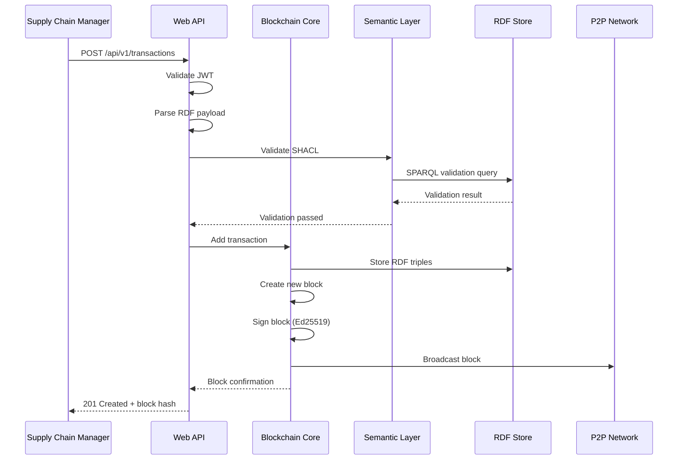
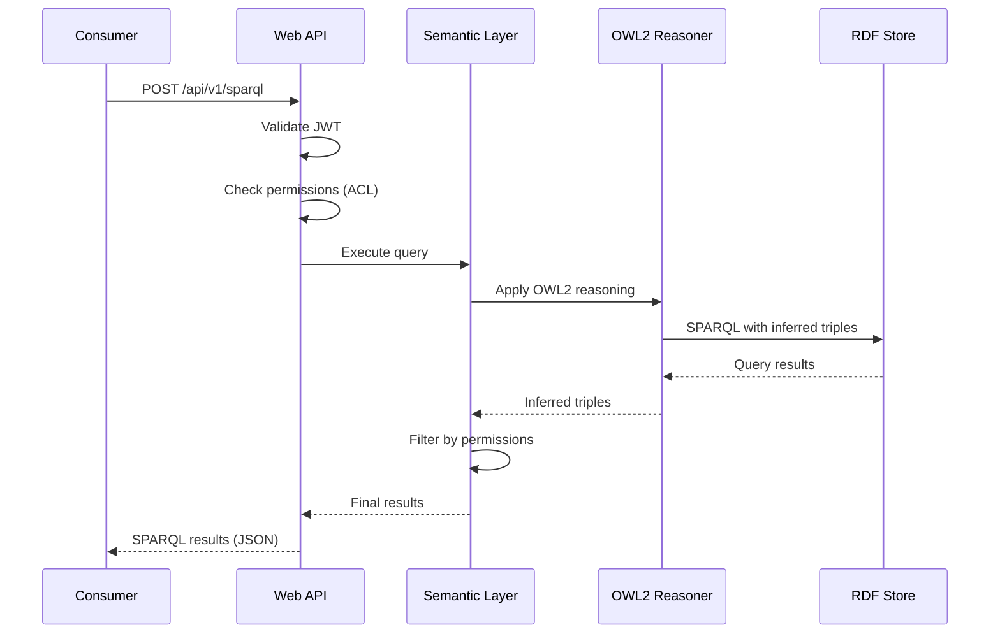
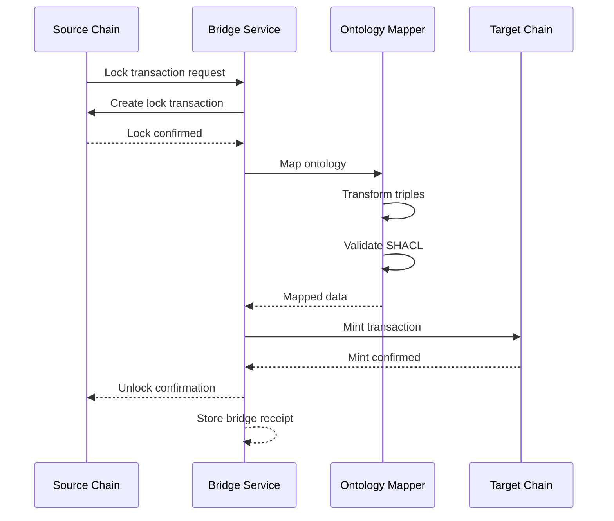

# ProvChainOrg Container Architecture Documentation

## C4 Model: Level 2 - Container Architecture

**Version:** 1.0
**Last Updated:** 2026-01-17
**Related:** [System Context](./SYSTEM_CONTEXT.md)

---

## 1. Container Overview

### 1.1 Definition

A **container** in ProvChainOrg is a deployable unit (application, data store, or service) that can be executed independently. This includes web services, background processes, databases, and external systems.

### 1.2 Container Map

```mermaid
C4Container
    title ProvChainOrg Container Architecture

    Person(supply_chain_manager, "Supply Chain Manager")
    Person(consumer, "Consumer")
    Person(auditor, "Regulatory Auditor")

    System_Boundary(provchain, "ProvChainOrg System") {
        Container(web_api, "Web API", "Axum + JWT", "REST and SPARQL endpoint for transaction submission and queries")
        Container(blockchain_core, "Blockchain Core", "Rust Service", "Blockchain state management, consensus, and P2P networking")
        Container(semantic_layer, "Semantic Layer", "OWL2 Reasoner", "OWL2 reasoning, SHACL validation, and knowledge graph management")
        Container(rdf_store, "RDF Store", "Oxigraph", "Persistent RDF triple store with SPARQL 1.1 support")
        Container(monitoring, "Monitoring Stack", "Prometheus + Grafana", "Metrics collection and visualization")
    }

    System_Boundary(external, "External Systems") {
        ContainerDb(erp_db, "ERP Database", "Relational", "Enterprise transaction data")
        Container(iot_gateway, "IoT Gateway", "MQTT Broker", "Sensor data aggregation")
        ContainerExt(other_chain, "Other Blockchain", "External", "Partner blockchain systems")
    }

    Rel(supply_chain_manager, web_api, "Submit transactions", "REST/JSON")
    Rel(consumer, web_api, "Query product", "SPARQL")
    Rel(auditor, web_api, "Audit chain", "REST/SPARQL")

    Rel(web_api, blockchain_core, "Add transaction", "gRPC")
    Rel(web_api, semantic_layer, "Execute query", "SPARQL")
    Rel(blockchain_core, rdf_store, "Store RDF", "SPARQL Update")
    Rel(semantic_layer, rdf_store, "Query RDF", "SPARQL")
    Rel(blockchain_core, semantic_layer, "Validate", "API")

    Rel(blockchain_core, other_chain, "Cross-chain bridge", "Lock & Mint Protocol")
    Rel(iot_gateway, web_api, "Sensor data", "WebSocket")
    Rel(erp_db, web_api, "Batch submit", "REST API")

    Rel(blockchain_core, monitoring, "Metrics", "Prometheus Protocol")
    Rel(semantic_layer, monitoring, "Metrics", "Prometheus Protocol")
```

---

## 2. Container Details

### 2.1 Web API Container

**Technology:** Axum Web Framework + JWT Authentication

**Responsibilities:**
- REST API for transaction submission
- SPARQL endpoint for semantic queries
- JWT authentication and authorization
- Request validation and rate limiting

**Interfaces:**
```rust
// REST Endpoints
POST   /api/v1/transactions          // Submit transaction
GET    /api/v1/blocks/{hash}         // Get block by hash
GET    /api/v1/transactions/{id}     // Get transaction by ID
POST   /api/v1/graphql               // GraphQL query (future)

// SPARQL Endpoint
POST   /api/v1/sparql                // SPARQL 1.1 query

// Authentication
POST   /auth/login                   // JWT token issuance
POST   /auth/refresh                 // Token refresh
```

**Resource Requirements:**
- CPU: 2 cores
- Memory: 4 GB
- Storage: 10 GB (logs)
- Network: 1 Gbps

**Quality Attributes:**
- Availability: 99.9%
- Response Time (P95): < 100ms
- Throughput: 1000 requests/second

---

### 2.2 Blockchain Core Container

**Technology:** Rust + Tokio Async Runtime

**Responsibilities:**
- Block creation and validation
- Consensus protocol execution (PoA/PBFT)
- P2P network management
- Ed25519 signature verification
- Chain state management

**Key Components:**

```rust
pub struct Blockchain {
    // State
    blocks: Vec<Block>,
    state: ChainState,
    utxo_set: UTXOSet,  // If using UTXO model

    // Networking
    p2p: P2PNetwork,
    peers: Vec<Peer>,

    // Consensus
    consensus: Box<dyn ConsensusProtocol>,
    validator_key: SigningKey,

    // Semantic integration
    rdf_store: Arc<RdfStore>,
}
```

**Interfaces:**
```rust
// Blockchain API
impl Blockchain {
    pub async fn add_transaction(&mut self, tx: Transaction) -> Result<H256>;
    pub async fn get_block(&self, hash: H256) -> Option<Block>;
    pub async fn get_transaction(&self, id: TxId) -> Option<Transaction>;
    pub async fn execute_sparql(&self, query: &str) -> Result<QueryResult>;

    // P2P API
    pub async fn broadcast_block(&self, block: Block);
    pub async fn handle_peer_message(&mut self, msg: PeerMessage);

    // Consensus API
    pub async fn start_consensus(&mut self);
    pub fn switch_consensus(&mut self, protocol: ConsensusType);
}
```

**Resource Requirements:**
- CPU: 4 cores (PoA) to 8 cores (PBFT)
- Memory: 8 GB
- Storage: 500 GB (blockchain data)
- Network: 10 Gbps (P2P traffic)

**Quality Attributes:**
- Fault Tolerance: 1/3 nodes (PBFT)
- Block Time: 1 second (PoA), 3-5 seconds (PBFT)
- Throughput: 8,500 TPS (PoA), 3,000 TPS (PBFT)

---

### 2.3 Semantic Layer Container

**Technology:** OWL2 Reasoner + SHACL Validator

**Responsibilities:**
- OWL2 RL reasoning (property chains, hasKey, qualified cardinality)
- SHACL validation (shape-based constraints)
- SPARQL query optimization
- Knowledge graph inference

**Architecture:**

```rust
pub struct SemanticLayer {
    // OWL2 Reasoner
    reasoner: Owl2Reasoner,
    ontology: Ontology,

    // SHACL Validator
    validator: ShaclValidator,
    shapes: Vec<Shape>,

    // Query Engine
    query_engine: QueryEngine,
    cache: QueryCache,
}

impl SemanticLayer {
    // OWL2 Reasoning
    pub async fn reason(&self, data: &Graph) -> Result<InferredTriples>;
    pub async fn apply_property_chain(&self, subject: &Resource) -> Result<Vec<Resource>>;
    pub async fn validate_haskey(&self, data: &Graph) -> Result<ValidationReport>;

    // SHACL Validation
    pub async fn validate(&self, data: &Graph) -> Result<ValidationReport>;
    pub async fn check_constraints(&self, triples: &[Triple]) -> Result<Vec<ConstraintViolation>>;

    // Query Execution
    pub async fn execute_query(&self, query: &str) -> Result<QueryResult>;
    pub async fn optimize_query(&self, query: &ParsedQuery) -> Result<OptimizedQuery>;
}
```

**Reasoning Capabilities:**

| Feature | OWL2 Construct | Use Case |
|---------|---------------|----------|
| Property Chains | `owl:propertyChainAxiom` | Transitive supplier relationships |
| Uniqueness | `owl:hasKey` | Product identification |
| Cardinality | `owl:qualifiedCardinality` | Certification requirements |
| Class Expression | `owl:intersectionOf` | Complex product categorization |

**Resource Requirements:**
- CPU: 4 cores (parallel reasoning)
- Memory: 16 GB (ontology + inferences)
- Storage: 100 GB (ontology cache)
- Network: 1 Gbps

**Quality Attributes:**
- Reasoning Latency: < 100ms (complex queries)
- Validation Accuracy: 100% (SHACL spec)
- Cache Hit Rate: > 80%

---

### 2.4 RDF Store Container

**Technology:** Oxigraph (RDF/SPARQL Database)

**Responsibilities:**
- Persistent RDF triple storage
- SPARQL 1.1 query execution
- RDF canonicalization (RDFC-1.0)
- Transaction management (ACID)

**Schema:**

```
Named Graphs:
- http://provchain.org/blocks/{hash}     // Block RDF graphs
- http://provchain.org/transactions/{id} // Transaction RDF graphs
- http://provchain.org/ontology          // Shared ontology
- http://provchain.org/shacl             // SHACL shapes
```

**Data Model:**

```turtle
# Example: Supply Chain Transaction
@prefix ex: <http://example.org/supply-chain> .
@prefix xsd: <http://www.w3.org/2001/XMLSchema#> .

ex:Product-LOT1234 a ex:Product ;
    ex:lotNumber "LOT-1234"^^xsd:string ;
    ex:productName "Organic Coffee"^^xsd:string ;
    ex:producedBy ex:Farm-A ;
    ex:productionDate "2024-01-15"^^xsd:date ;
    ex:hasTransaction ex:Tx-001 .

ex:Tx-001 a ex:Transaction ;
    ex:transactionType "harvest"^^xsd:string ;
    ex:timestamp "2024-01-15T08:30:00Z"^^xsd:dateTime ;
    ex:location ex:Location-ChiangMai ;
    ex:handledBy ex:Farmer-John ;
    ex:temperature 25.0^^xsd:float ;
    ex:certifiedBy ex:Cert-USDA-Organic .
```

**SPARQL Endpoints:**

```sparql
# Query Endpoint
POST /sparql/query
Content-Type: application/sparql-query

# Update Endpoint
POST /sparql/update
Content-Type: application/sparql-update

# Graph Store Protocol
GET   /sparql/graph/{graph_uri}
PUT   /sparql/graph/{graph_uri}
DELETE /sparql/graph/{graph_uri}
```

**Resource Requirements:**
- CPU: 8 cores (query parallelization)
- Memory: 32 GB (in-memory triple cache)
- Storage: 1 TB (RDF data + indexes)
- Network: 10 Gbps

**Quality Attributes:**
- Query Latency (P95): < 50ms
- Storage Overhead: 3-5× (vs relational)
- Index Types: SPO, POS, OSP, GSPO

---

### 2.5 Monitoring Stack Container

**Technology:** Prometheus + Grafana + Jaeger

**Responsibilities:**
- Metrics collection and aggregation
- Dashboard visualization
- Distributed tracing
- Alert generation

**Metrics Collected:**

```rust
// Blockchain Metrics
blockchain_block_height{node_id}
blockchain_transactions_per_second
blockchain_block_time_seconds
blockchain_peer_count

// Semantic Layer Metrics
semantic_reasoning_duration_seconds{query_type}
semantic_shacl_validation_duration_seconds
semantic_sparql_query_duration_seconds{complexity}

// RDF Store Metrics
rdf_triple_count{graph_uri}
rdf_query_cache_hit_rate
rdf_storage_size_bytes
```

**Dashboards:**

1. **System Overview** - Health status, node count, chain height
2. **Performance** - TPS, latency, block time
3. **Semantic Layer** - Reasoning time, validation results
4. **Storage** - Triple count, storage usage, cache metrics

**Resource Requirements:**
- CPU: 2 cores
- Memory: 8 GB
- Storage: 500 GB (metrics retention)
- Network: 1 Gbps

---

## 3. Container Interactions

### 3.1 Transaction Submission Flow



### 3.2 SPARQL Query Flow



### 3.3 Cross-Chain Bridge Flow



---

## 4. Deployment Architecture

### 4.1 Single-Node Deployment (Development)

```
┌─────────────────────────────────────────────────────────────┐
│                    Docker Compose                          │
├─────────────────────────────────────────────────────────────┤
│                                                             │
│  ┌──────────────────────────────────────────────────────┐  │
│  │  provchain-web-api  │  provchain-core              │  │
│  │  Port: 8080         │  Port: 30303 (P2P)            │  │
│  └──────────────────────────────────────────────────────┘  │
│                                                             │
│  ┌──────────────────────────────────────────────────────┐  │
│  │  provchain-semantic │  oxigraph-rdf-store           │  │
│  │  (no external port)  │  Port: 7878 (SPARQL)        │  │
│  └──────────────────────────────────────────────────────┘  │
│                                                             │
│  ┌──────────────────────────────────────────────────────┐  │
│  │  prometheus         │  grafana                      │  │
│  │  Port: 9090         │  Port: 3000                   │  │
│  └──────────────────────────────────────────────────────┘  │
│                                                             │
└─────────────────────────────────────────────────────────────┘
```

### 4.2 Multi-Node Deployment (Production)

```
┌─────────────────────────────────────────────────────────────┐
│                    Kubernetes Cluster                       │
├─────────────────────────────────────────────────────────────┤
│                                                             │
│  Namespace: provchain-prod                                  │
│                                                             │
│  ┌──────────────────────────────────────────────────────┐  │
│  │  Deployment: web-api (3 replicas)                   │  │
│  │  Service: web-api-service (LoadBalancer)             │  │
│  │  Ingress: api.provchain.org                          │  │
│  └──────────────────────────────────────────────────────┘  │
│                                                             │
│  ┌──────────────────────────────────────────────────────┐  │
│  │  StatefulSet: blockchain-core (4 nodes)              │  │
│  │  Service: p2p-cluster (ClusterIP)                    │  │
│  │  Peer discovery: Headless service                    │  │
│  └──────────────────────────────────────────────────────┘  │
│                                                             │
│  ┌──────────────────────────────────────────────────────┐  │
│  │  Deployment: semantic-layer (2 replicas)             │  │
│  │  Deployment: rdf-store (1 replica, PVC)              │  │
│  └──────────────────────────────────────────────────────┘  │
│                                                             │
│  ┌──────────────────────────────────────────────────────┐  │
│  │  Namespace: monitoring                               │  │
│  │  Deployment: prometheus                              │  │
│  │  Deployment: grafana                                 │  │
│  └──────────────────────────────────────────────────────┘  │
│                                                             │
└─────────────────────────────────────────────────────────────┘
```

### 4.3 Resource Allocation

| Container | CPU Request | CPU Limit | Memory Request | Memory Limit |
|-----------|-------------|-----------|----------------|--------------|
| web-api | 500m | 2000m | 2 Gi | 4 Gi |
| blockchain-core | 2000m | 4000m | 4 Gi | 8 Gi |
| semantic-layer | 1000m | 2000m | 8 Gi | 16 Gi |
| rdf-store | 2000m | 4000m | 16 Gi | 32 Gi |
| prometheus | 500m | 1000m | 2 Gi | 4 Gi |
| grafana | 200m | 500m | 512 Mi | 1 Gi |

---

## 5. Communication Protocols

### 5.1 Synchronous Communication

| Protocol | Purpose | Format | Port |
|----------|---------|--------|------|
| REST/JSON | Transaction submission | JSON | 8080 |
| SPARQL 1.1 | Semantic queries | SPARQL XML/JSON | 8080 |
| gRPC | Internal services | Protocol Buffers | 50051 |
| WebSocket | Real-time updates | JSON | 8080/ws |

### 5.2 P2P Communication

| Protocol | Purpose | Format | Port |
|----------|---------|--------|------|
| Libp2p | Peer discovery | Protobuf | 30303 |
| Block sync | Chain synchronization | Binary | 30303 |
| Consensus | PBFT voting | Binary | 30304 |

---

## 6. Data Flow

### 6.1 Transaction Flow

```
1. Client → Web API: Submit transaction (RDF)
2. Web API → Semantic Layer: Validate SHACL
3. Semantic Layer → RDF Store: Check constraints
4. Web API → Blockchain Core: Add to mempool
5. Blockchain Core → Consensus: Agree on block
6. Blockchain Core → RDF Store: Persist block graph
7. Blockchain Core → P2P: Broadcast new block
```

### 6.2 Query Flow

```
1. Client → Web API: SPARQL query
2. Web API: Check JWT + ACL permissions
3. Web API → Semantic Layer: Execute query
4. Semantic Layer → OWL2 Reasoner: Apply inference
5. Semantic Layer → RDF Store: Query + inference
6. Semantic Layer: Filter results by permissions
7. Semantic Layer → Web API: Return results
```

---

## 7. Technology Rationale

### 7.1 Rust for Core Blockchain

**Decision:** Use Rust for blockchain core implementation

**Rationale:**
- Memory safety without GC (predictable latency)
- Zero-cost abstractions (performance)
- Strong typing (reduces bugs)
- Fearless concurrency (Tokio)

**Trade-offs:**
- Steeper learning curve
- Longer development time vs interpreted languages

### 7.2 Oxigraph for RDF Storage

**Decision:** Use Oxigraph as RDF triple store

**Rationale:**
- Pure Rust implementation
- SPARQL 1.1 compliant
- RDF canonicalization support (RDFC-1.0)
- Embedded or server mode

**Alternatives Considered:**
- **Apache Jena:** Java-based, heavier resource requirements
- **Blazegraph:** Excellent performance, but Java-based
- **Virtuoso:** Enterprise features, but complex setup

### 7.3 Axum for Web API

**Decision:** Use Axum web framework

**Rationale:**
- Tower middleware ecosystem
- Type-safe routing
- Async-first design
- Minimal overhead

**Alternatives Considered:**
- **Actix Web:** Mature, but more complex
- **Rocket:** Excellent ergonomics, but async support immature

---

## 8. Related Documentation

- [System Context](./SYSTEM_CONTEXT.md) - C4 Level 1
- [Component Architecture](./COMPONENT_ARCHITECTURE.md) - C4 Level 3
- [Data Architecture](./DATA_ARCHITECTURE.md) - Data models and flows
- [Deployment Guide](./../deployment/HANDS_ON_DEPLOYMENT_GUIDE.md)
