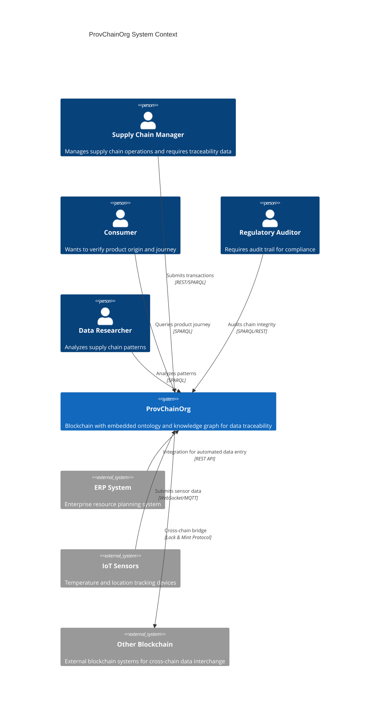

# ProvChainOrg System Context Documentation

## C4 Model: Level 1 - System Context

**Version:** 1.0
**Last Updated:** 2026-01-17
**Author:** Anusorn Chaikaew (Student Code: 640551018)
**Thesis:** Enhancement of Blockchain with Embedded Ontology and Knowledge Graph for Data Traceability

---

## 1. System Overview

### 1.1 System Purpose

ProvChainOrg is a distributed blockchain system that enhances traditional blockchain technology by embedding semantic web technologies (RDF ontologies and knowledge graphs) directly into the blockchain data structure. The system is specifically designed for supply chain traceability and medical data management where:

- **Data traceability** is critical for regulatory compliance and consumer safety
- **Semantic understanding** of relationships between transactions is required
- **Permission control** at the data owner level is necessary
- **Cross-chain interoperability** enables multi-party supply chain collaboration

### 1.2 System Scope

**In Scope:**
- Blockchain with embedded RDF/OWL2 ontology
- SPARQL query capability for semantic reasoning
- Multi-consensus protocol support (PoA/PBFT)
- Owner-controlled data visibility
- Cross-chain bridge with ontology mapping

**Out of Scope:**
- Smart contract execution (intentional trade-off)
- Cryptocurrency/financial transaction processing
- General-purpose computing platform

---

## 2. System Context Diagram



---

## 3. Stakeholders

| Stakeholder | Role | Interests | Requirements |
|-------------|------|-----------|--------------|
| **Supply Chain Manager** | Primary User | Efficient data submission, query capabilities | < 100ms query response, batch transaction support |
| **Consumer** | End User | Product verification, safety information | Simple query interface, mobile-friendly |
| **Regulatory Auditor** | Compliance | Complete audit trail, data integrity | Tamper-evident records, SPARQL access |
| **Data Researcher** | Analyst | Pattern discovery, analytics | Complex query support, export capabilities |
| **System Administrator** | Operations | System health, maintenance | Monitoring, alerting, backup tools |
| **Thesis Committee** | Academic Review | Research validation, reproducibility | Documentation, experimental results |

---

## 4. External Systems

### 4.1 ERP System Integration

**Purpose:** Automated transaction submission from enterprise systems

**Protocol:** REST API with JWT authentication

**Data Flow:**
```
ERP System → Submit Transaction → ProvChainOrg → Confirmation Receipt
```

**Use Cases:**
- Batch transaction submission (1000+ transactions)
- Automated supply chain event recording
- Integration with SAP, Oracle, Microsoft Dynamics

### 4.2 IoT Sensor Integration

**Purpose:** Real-time sensor data for cold chain monitoring

**Protocol:** WebSocket or MQTT

**Data Types:**
- Temperature readings (2-8°C for pharmaceuticals)
- GPS location tracking
- Humidity levels
- Shock/vibration events

**Data Flow:**
```
IoT Device → WebSocket → ProvChainOrg → RDF Triple Storage
```

### 4.3 Cross-Chain Bridge

**Purpose:** Data interchange with other blockchain systems

**Protocol:** Lock & Mint with ontology mapping

**Use Cases:**
- Multi-tier supply chains (different blockchains per tier)
- Industry consortium data sharing
- Regulatory reporting to government blockchains

---

## 5. Key Quality Attributes

### 5.1 Performance

| Metric | Target | Measurement |
|--------|--------|-------------|
| Write Throughput | > 8,000 TPS | Transactions per second |
| Read Latency (P95) | < 50ms | SPARQL query response time |
| Block Time | 1 second | Time between blocks |
| OWL2 Reasoning | < 100ms | Complex inference queries |

### 5.2 Reliability

| Attribute | Target | Implementation |
|-----------|--------|----------------|
| Availability | 99.9% | Distributed P2P network |
| Data Integrity | 100% | Ed25519 signatures, hash validation |
| Fault Tolerance | 1/3 nodes (PBFT) | Consensus protocol |
| Recovery Time | < 5 minutes | Automated replay from persistent storage |

### 5.3 Security

| Attribute | Target | Implementation |
|-----------|--------|----------------|
| Authentication | JWT + Ed25519 | Multi-factor authentication |
| Authorization | Owner-controlled | ACL-based permission system |
| Encryption | ChaCha20-Poly1305 | Private data protection |
| Audit Trail | Immutable | Blockchain append-only log |

### 5.4 Scalability

| Dimension | Current | Target |
|-----------|---------|--------|
| Transactions/Day | 100,000 | 10,000,000 |
| Concurrent Users | 100 | 10,000 |
| Data Storage | 100 GB | 10 TB |
| Network Nodes | 4 | 100+ |

---

## 6. Business Domain Model

### 6.1 Core Concepts

```
┌─────────────────────────────────────────────────────────────┐
│                   BUSINESS DOMAIN MODEL                     │
├─────────────────────────────────────────────────────────────┤
│                                                             │
│  ┌──────────────┐      ┌──────────────┐                  │
│  │   Product    │──────│ Transaction  │                  │
│  │              │      │              │                  │
│  │ - lotNumber  │      │ - timestamp  │                  │
│  │ - productName│      │ - type       │                  │
│  │ - origin     │      │ - location   │                  │
│  │ - currentLoc │      │ - handler    │                  │
│  └──────────────┘      └──────────────┘                  │
│         │                      │                           │
│         └──────────┬───────────┘                           │
│                    │                                       │
│         ┌──────────▼──────────┐                           │
│         │  Certification      │                           │
│         │                     │                           │
│         │ - type              │                           │
│         │ - issuedBy          │                           │
│         │ - validUntil        │                           │
│         └─────────────────────┘                           │
│                                                             │
│  OWL2 Relationships:                                       │
│  - ex:suppliedBy (transitive via property chain)           │
│  - ex:hasCertification (qualified cardinality)            │
│  - ex:lotNumber (hasKey uniqueness constraint)             │
└─────────────────────────────────────────────────────────────┘
```

### 6.2 Use Case Summary

| Use Case | Actor | Description | Frequency |
|----------|-------|-------------|-----------|
| Submit Transaction | Supply Chain Manager | Record supply chain event | 1000/hour |
| Trace Product | Consumer | Query product journey | 10,000/day |
| Audit Chain | Auditor | Verify data integrity | 100/day |
| Cross-Chain Transfer | Bridge Operator | Transfer data between chains | 10/day |
| Analytics Query | Researcher | Complex SPARQL analysis | 50/day |

---

## 7. Technology Stack Overview

### 7.1 Core Technologies

```
┌─────────────────────────────────────────────────────────────┐
│                   TECHNOLOGY STACK                         │
├─────────────────────────────────────────────────────────────┤
│                                                             │
│  Application Layer:                                         │
│  - Axum (Web Framework)                                     │
│  - JWT (jsonwebtoken)                                       │
│  - Tokio (Async Runtime)                                    │
│                                                             │
│  Blockchain Core:                                           │
│  - Ed25519 (Digital Signatures)                             │
│  - SHA-256 (Hash Function)                                  │
│  - WebSocket (P2P Communication)                            │
│                                                             │
│  Semantic Layer:                                            │
│  - Oxigraph (RDF/SPARQL Store)                              │
│  - OWL2 RL (Reasoner)                                      │
│  - SHACL (Validation)                                       │
│                                                             │
│  Storage:                                                   │
│  - RDF N-Triples (Canonicalizable)                          │
│  - ChaCha20-Poly1305 (Encryption)                           │
│  - Persistent Backend (File system)                         │
│                                                             │
└─────────────────────────────────────────────────────────────┘
```

### 7.2 Dependencies

**Production Dependencies:**
- Rust 1.70+ (Edition 2021)
- Cargo workspace with `owl2-reasoner` member
- Docker (for deployment and benchmarking)

**External Services:**
- None (fully decentralized)

---

## 8. Constraints and Limitations

### 8.1 Technical Constraints

| Constraint | Impact | Mitigation |
|------------|--------|------------|
| No smart contracts | Limited programmability | Focus on data traceability |
| RDF storage overhead | Larger block size | Compression, pruning |
| OWL2 reasoning performance | Query latency | Caching, optimization |

### 8.2 Business Constraints

| Constraint | Impact | Mitigation |
|------------|--------|------------|
| Thesis timeline | Feature scope | Prioritize core innovations |
| Single developer | Bus factor = 1 | Documentation, modular design |
| Academic validation | Rigorous testing required | Comprehensive benchmark suite |

---

## 9. Open Questions

1. **Production Deployment:** What is the path from research prototype to production system?
2. **Consensus Upgrade:** How to upgrade consensus protocol without chain fork?
3. **Privacy Regulations:** GDPR compliance for immutable blockchain data?
4. **Quantum Threat:** Timeline for NIST post-quantum cryptography migration?

---

## 10. Related Documentation

- [Container Architecture](./CONTAINER_ARCHITECTURE.md) - C4 Level 2
- [Component Architecture](./COMPONENT_ARCHITECTURE.md) - C4 Level 3
- [Architecture Decision Records](./ADR/) - Historical decisions
