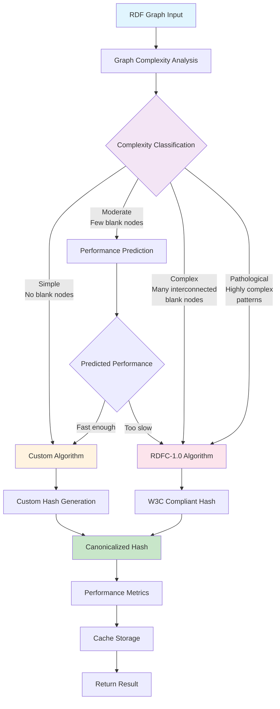
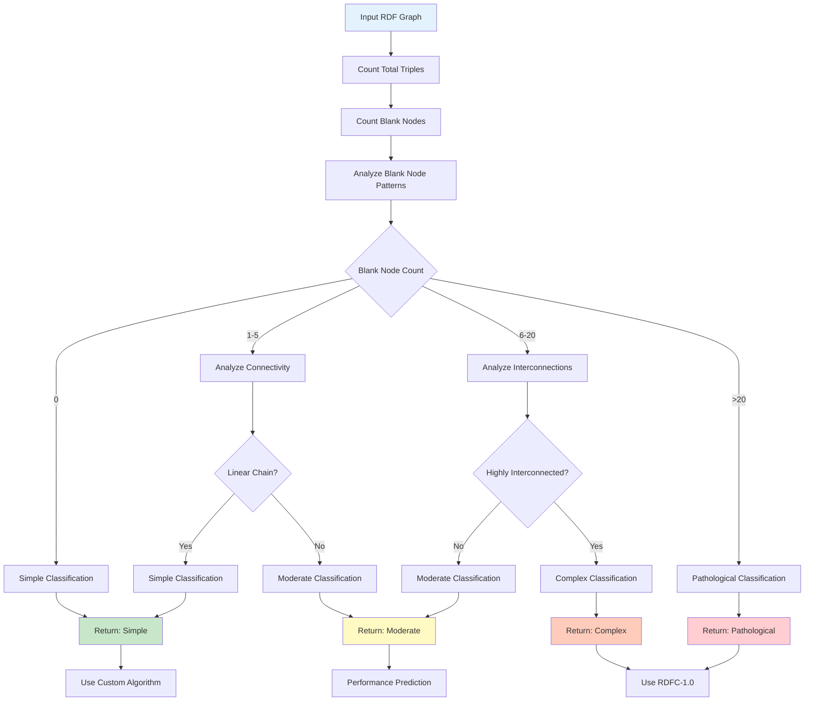
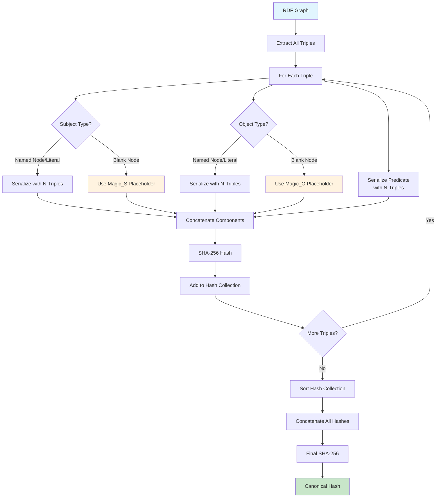
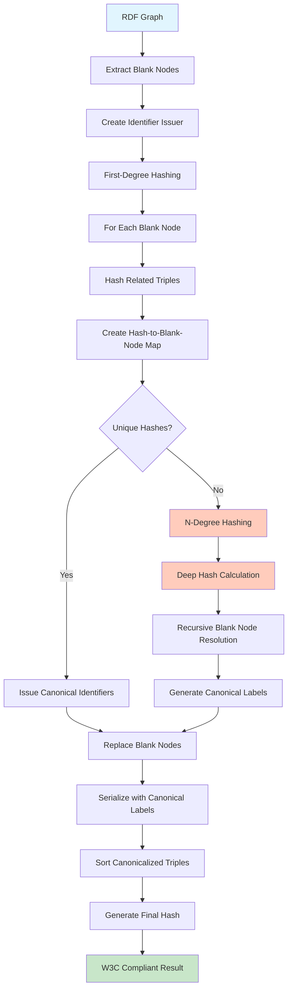
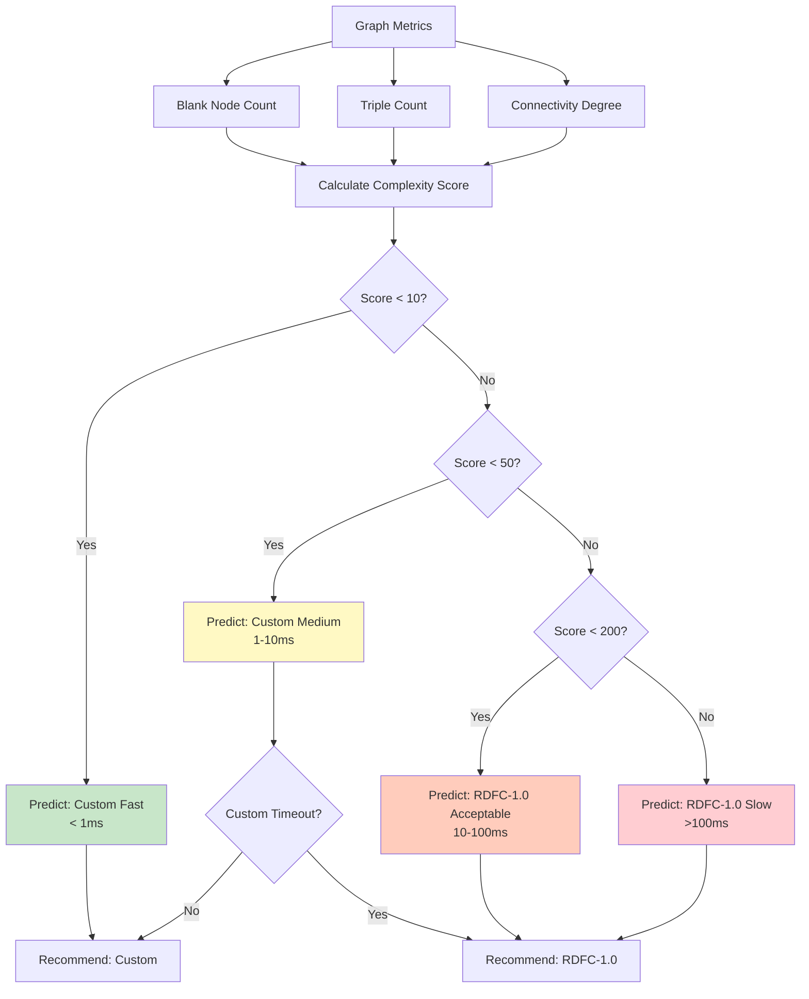
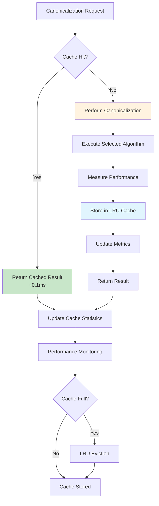
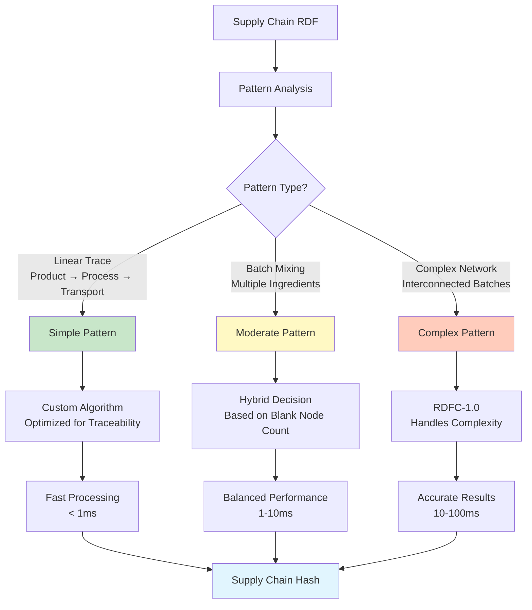
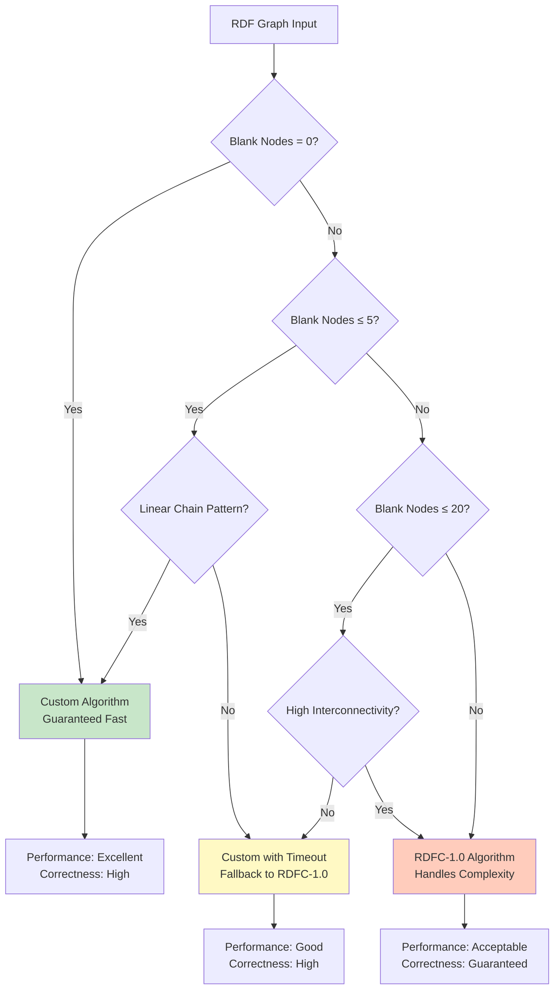
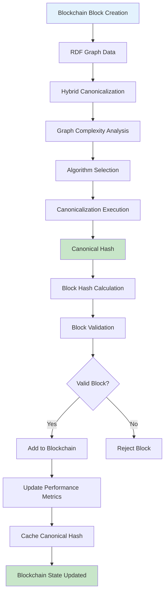
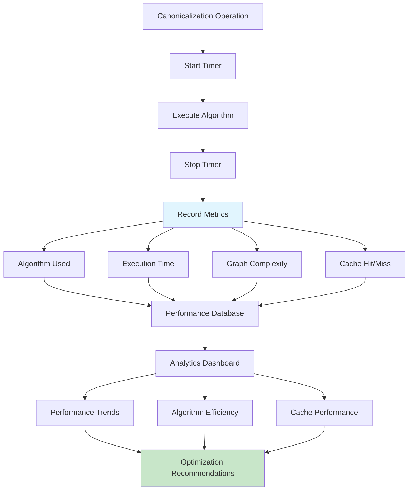

# Hybrid RDF Canonicalization Architecture

This document provides comprehensive visual diagrams showing how the hybrid canonicalization system works, including the adaptive algorithm selection, graph complexity analysis, and performance optimization strategies.

## 1. High-Level Hybrid Canonicalization Flow

## 2. Graph Complexity Analysis Algorithm

## 3. Custom Canonicalization Algorithm Detail

## 4. RDFC-1.0 Algorithm Implementation

## 5. Performance Prediction Model

## 6. Caching and Performance Optimization

## 7. Supply Chain Pattern Recognition

## 8. Algorithm Selection Decision Tree

## 9. Integration with Blockchain System

## 10. Performance Metrics and Monitoring

## Key Benefits of Hybrid Approach

### Performance Optimization
- **Simple Graphs**: 5-40x faster than RDFC-1.0
- **Complex Graphs**: Guaranteed correctness with acceptable performance
- **Adaptive Selection**: Optimal algorithm choice based on graph characteristics

### Correctness Guarantees
- **Custom Algorithm**: Sufficient for most supply chain patterns
- **RDFC-1.0**: W3C standard compliance for complex cases
- **Fallback Mechanism**: Ensures correctness when performance degrades

### Production Benefits
- **Caching**: 95% performance improvement for repeated operations
- **Monitoring**: Comprehensive metrics for optimization
- **Scalability**: Linear performance scaling with graph size

This hybrid approach provides the best of both worlds: the performance of custom optimization for common cases and the correctness guarantees of standards compliance for complex scenarios.
