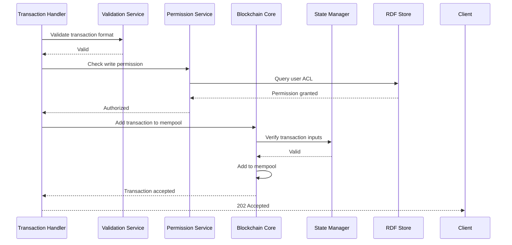
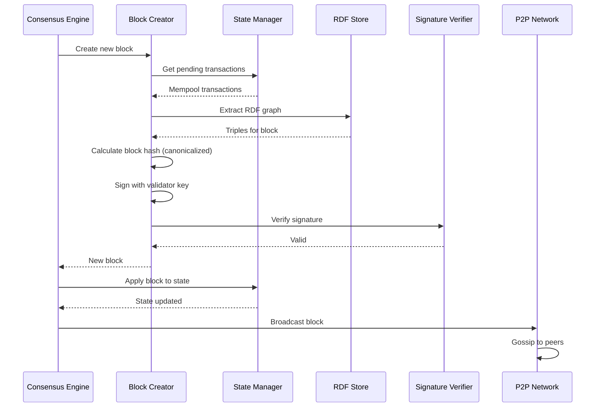

# ProvChainOrg Component Architecture Documentation

## C4 Model: Level 3 - Component Architecture

**Version:** 1.0
**Last Updated:** 2026-01-17
**Related:** [System Context](./SYSTEM_CONTEXT.md) | [Container Architecture](./CONTAINER_ARCHITECTURE.md)

---

## 1. Component Overview

### 1.1 Blockchain Core Components

```mermaid
C4Component
    title Blockchain Core Component Architecture

    Container(blockchain_core, "Blockchain Core", "Rust Service") {
        Component(state_manager, "State Manager", "Manages blockchain state and UTXO set")
        Component(consensus_engine, "Consensus Engine", "PoA/PBFT consensus implementation")
        Component(block_creator, "Block Creator", "Constructs and signs new blocks")
        Component(signature_verifier, "Signature Verifier", "Ed25519 signature validation")
        Component(chain_reorg, "Chain Reorganizer", "Handles chain forks and reorganizations")
        Component(p2p_network, "P2P Network", "Peer discovery and message routing")
    }

    Rel(consensus_engine, state_manager, "Read state")
    Rel(consensus_engine, block_creator, "Request block creation")
    Rel(block_creator, state_manager, "Get transactions")
    Rel(block_creator, signature_verifier, "Verify signatures")
    Rel(p2p_network, consensus_engine, "Broadcast messages")
    Rel(chain_reorg, state_manager, "Reorganize chain")
```

### 1.2 Semantic Layer Components

```mermaid
C4Component
    title Semantic Layer Component Architecture

    Container(semantic_layer, "Semantic Layer", "OWL2 Reasoner") {
        Component(owl2_reasoner, "OWL2 Reasoner", "Property chains, hasKey, cardinality")
        Component(shacl_validator, "SHACL Validator", "Shape-based constraint validation")
        Component(query_optimizer, "Query Optimizer", "SPARQL query optimization")
        Component(inference_engine, "Inference Engine", "Rule-based forward chaining")
        Component(ontology_manager, "Ontology Manager", "Ontology loading and caching")
        Component(permission_filter, "Permission Filter", "ACL-based result filtering")
    }

    Rel(query_optimizer, owl2_reasoner, "Request inference")
    Rel(query_optimizer, shacl_validator, "Validate constraints")
    Rel(owl2_reasoner, inference_engine, "Execute rules")
    Rel(inference_engine, ontology_manager, "Load axioms")
    Rel(query_optimizer, permission_filter, "Filter results")
```

### 1.3 Web API Components

```mermaid
C4Component
    title Web API Component Architecture

    Container(web_api, "Web API", "Axum Framework") {
        Component(auth_middleware, "Auth Middleware", "JWT validation")
        Component(rate_limiter, "Rate Limiter", "Request throttling")
        Component(transaction_handler, "Transaction Handler", "Transaction submission processing")
        Component(query_handler, "Query Handler", "SPARQL query execution")
        Component(permission_service, "Permission Service", "ACL management")
        Component(validation_service, "Validation Service", "Request validation")
    }

    Rel(auth_middleware, transaction_handler, "Forward authenticated")
    Rel(auth_middleware, query_handler, "Forward authenticated")
    Rel(rate_limiter, auth_middleware, "Check rate limit")
    Rel(transaction_handler, validation_service, "Validate payload")
    Rel(transaction_handler, permission_service, "Check write permissions")
    Rel(query_handler, permission_service, "Check read permissions")
```

---

## 2. Component Details

### 2.1 State Manager

**File:** `src/core/state.rs`

**Responsibilities:**
- Maintain current blockchain state (UTXO set or account state)
- Track chain height and latest block hash
- Provide state queries for consensus and validation
- Handle state rollbacks during chain reorganization

**Key Types:**

```rust
pub struct StateManager {
    /// Current chain height
    height: u64,

    /// Latest block hash
    latest_hash: H256,

    /// UTXO set (if using UTXO model)
    utxo_set: UTXOSet,

    /// Pending state changes
    pending: HashMap<H256, StateDelta>,

    /// Persistent storage backend
    storage: Arc<PersistentStorage>,
}

impl StateManager {
    /// Get current chain height
    pub fn height(&self) -> u64;

    /// Get latest block hash
    pub fn latest_hash(&self) -> H256;

    /// Get UTXO by outpoint
    pub fn get_utxo(&self, outpoint: OutPoint) -> Option<UTXO>;

    /// Apply block to state
    pub fn apply_block(&mut self, block: &Block) -> Result<(), StateError>;

    /// Rollback state to previous block
    pub fn rollback(&mut self, height: u64) -> Result<(), StateError>;

    /// Create state snapshot
    pub fn snapshot(&self) -> StateSnapshot;
}
```

**Quality Attributes:**
- **Availability:** State queries < 10ms (P99)
- **Consistency:** ACID guarantees for state updates
- **Recoverability:** Snapshot every 1000 blocks

---

### 2.2 Consensus Engine

**File:** `src/network/consensus.rs`

**Responsibilities:**
- Coordinate block creation across nodes
- Handle voting for PBFT consensus
- Manage validator set for PoA
- Detect and handle consensus failures

**Key Types:**

```rust
pub trait ConsensusProtocol: Send + Sync {
    /// Start consensus protocol
    async fn start(&mut self) -> Result<(), ConsensusError>;

    /// Handle incoming message from peer
    async fn handle_message(&mut self, msg: ConsensusMessage) -> Result<()>;

    /// Switch to different consensus protocol
    fn switch_protocol(&mut self, protocol: ConsensusType) -> Result<(), ConsensusError>;
}

pub struct ConsensusEngine {
    /// Current protocol
    protocol: Box<dyn ConsensusProtocol>,

    /// Validator public keys
    validators: Vec<PublicKey>,

    /// My validator index (if part of validator set)
    my_index: Option<usize>,

    /// Message channel for protocol communication
    message_tx: mpsc::UnboundedSender<ConsensusMessage>,
}

/// Proof of Authority consensus
pub struct PoAConsensus {
    leader: usize,
    round_duration: Duration,
}

/// PBFT consensus
pub struct PBFTConsensus {
    view: u64,
    sequence: u64,
    log: Vec<PBFTMessage>,
    prepared: HashSet<H256>,
}
```

**Consensus Protocols:**

| Protocol | Throughput | Latency | Fault Tolerance | Use Case |
|----------|------------|---------|-----------------|----------|
| PoA | 10,000+ TPS | < 100ms | 1 of N | Trusted consortium |
| PBFT | 3,000-5,000 TPS | 500-1000ms | 1/3 | Open network |

**Quality Attributes:**
- **Safety:** No two honest nodes commit different blocks
- **Liveness:** Progress if > 2/3 honest
- **Fairness:** Round-robin leader selection

---

### 2.3 Block Creator

**File:** `src/core/blockchain.rs`

**Responsibilities:**
- Construct new blocks from transactions
- Calculate block hash using RDF canonicalization
- Sign blocks with validator private key
- Maintain block size and gas limits

**Key Types:**

```rust
pub struct BlockCreator {
    /// Maximum block size (bytes)
    max_block_size: usize,

    /// Maximum transactions per block
    max_transactions: usize,

    /// Target block time (for PoA)
    target_block_time: Duration,

    /// Signing key for block signature
    signing_key: SigningKey,
}

impl BlockCreator {
    /// Create new block from mempool transactions
    pub async fn create_block(
        &self,
        transactions: Vec<Transaction>,
        previous_hash: H256,
        state: &StateManager,
        rdf_store: &RdfStore,
    ) -> Result<Block, BlockError>;

    /// Calculate block hash from RDF canonicalization
    pub fn calculate_block_hash(
        &self,
        header: &BlockHeader,
        rdf_graph: &Graph,
    ) -> H256 {
        // 1. Extract RDF triples
        // 2. Canonicalize using RDFC-1.0
        // 3. Combine with header metadata
        // 4. SHA-256 hash
    }

    /// Sign block with validator key
    pub fn sign_block(&self, block: &Block) -> Ed25519Signature {
        self.signing_key.sign(block.hash.as_bytes())
    }
}
```

**Block Structure:**

```rust
pub struct Block {
    pub header: BlockHeader,
    pub data_graph_iri: String,  // Named graph IRI in RDF store
    pub signature: Ed25519Signature,
}

pub struct BlockHeader {
    pub hash: H256,
    pub timestamp: u64,
    pub previous_hash: H256,
    pub validator_public_key: String,
    pub merkle_root: H256,  // Merkle root of transaction hashes
}
```

---

### 2.4 OWL2 Reasoner

**File:** `src/semantic/owl2_enhanced_reasoner.rs`

**Responsibilities:**
- Execute OWL2 RL reasoning rules
- Apply property chain axioms
- Validate hasKey uniqueness constraints
- Check qualified cardinality restrictions

**Key Types:**

```rust
pub struct Owl2Reasoner {
    /// Loaded ontology axioms
    axioms: Vec<Axiom>,

    /// Reasoning rules (forward chaining)
    rules: Vec<Rule>,

    /// Inference cache
    cache: LruCache<Graph, InferredTriples>,

    /// Reasoning configuration
    config: ReasoningConfig,
}

pub enum Axiom {
    /// Property chain: ex:suppliedBy o (ex:processedBy ex:sourcedFrom)
    PropertyChain {
        property: NamedNode,
        chain: Vec<NamedNode>,
    },

    /// hasKey constraint: ex:Product owl:hasKey (ex:lotNumber ex:manufacturer)
    HasKey {
        class: NamedNode,
        properties: Vec<NamedNode>,
    },

    /// Qualified cardinality: ex:Product ex:requiresCertification exactly 2 ex:OrganicCert
    QualifiedCardinality {
        class: NamedNode,
        property: NamedNode,
        cardinality: u32,
        filler: ClassExpression,
    },
}

impl Owl2Reasoner {
    /// Apply OWL2 reasoning to graph
    pub async fn reason(&self, graph: &Graph) -> Result<InferredTriples> {
        let mut inferred = Graph::new();

        // Apply property chains
        for axiom in &self.axioms {
            match axiom {
                Axiom::PropertyChain { property, chain } => {
                    self.apply_property_chain(graph, &mut inferred, property, chain)?;
                }
                // ... other axiom types
            }
        }

        Ok(InferredTriples { triples: inferred })
    }

    /// Validate hasKey uniqueness
    pub async fn validate_haskey(
        &self,
        graph: &Graph,
        axiom: &HasKey,
    ) -> Result<ValidationReport>;

    /// Validate qualified cardinality
    pub async fn validate_cardinality(
        &self,
        graph: &Graph,
        axiom: &QualifiedCardinality,
    ) -> Result<ValidationReport>;
}
```

**Reasoning Performance:**

| Query Type | Complexity | Performance (P95) |
|------------|-----------|-------------------|
| Simple lookup | O(log n) | < 10ms |
| Property chain (depth 2) | O(n²) | < 50ms |
| Property chain (depth 5) | O(n⁵) | < 200ms |
| hasKey validation | O(n log n) | < 30ms |
| Qualified cardinality | O(n) | < 20ms |

---

### 2.5 SHACL Validator

**File:** `src/semantic/shacl_validator.rs`

**Responsibilities:**
- Validate data against SHACL shapes
- Report constraint violations
- Support advanced SHACL features (deactivation, targets)

**Key Types:**

```rust
pub struct ShaclValidator {
    /// Loaded SHACL shapes
    shapes: Vec<Shape>,

    /// Validation configuration
    config: ValidationConfig,
}

pub struct Shape {
    pub iri: Iri,
    pub target: Target,
    pub constraints: Vec<Constraint>,
}

pub enum Target {
    /// All instances of a class
    ClassTarget(Class),

    /// Nodes matching SHACL SPARQL target
    SparqlTarget(String),

    /// Explicit set of nodes
    NodesTarget(Vec<Node>),
}

pub enum Constraint {
    /// MinCount constraint
    MinCount { property: Iri, min: usize },

    /// MaxCount constraint
    MaxCount { property: Iri, max: usize },

    /// Node constraint (kind, datatype)
    NodeKind(NodeKind),

    /// datatype constraint
    Datatype(Iri),

    /// Min/max inclusive
    MinInclusive(Literal),
    MaxInclusive(Literal),

    /// Pattern constraint
    Pattern(String),

    /// Custom SPARQL constraint
    SparqlConstraint(String),
}

impl ShaclValidator {
    /// Validate graph against all shapes
    pub async fn validate(&self, graph: &Graph) -> Result<ValidationReport> {
        let mut report = ValidationReport::new();

        for shape in &self.shapes {
            let focus_nodes = self.get_focus_nodes(graph, shape)?;

            for node in focus_nodes {
                for constraint in &shape.constraints {
                    if let Err(violation) = self.validate_constraint(graph, node, constraint) {
                        report.add_violation(violation);
                    }
                }
            }
        }

        Ok(report)
    }

    /// Get focus nodes for a shape based on target
    fn get_focus_nodes(&self, graph: &Graph, shape: &Shape) -> Result<Vec<Node>>;

    /// Validate single constraint
    fn validate_constraint(
        &self,
        graph: &Graph,
        node: &Node,
        constraint: &Constraint,
    ) -> Result<(), ConstraintViolation>;
}
```

**Validation Performance:**

| Shape Complexity | Focus Nodes | Constraints | Validation Time |
|-----------------|-------------|-------------|-----------------|
| Simple (1 constraint) | 1000 | 1 | < 50ms |
| Moderate (5 constraints) | 1000 | 5 | < 100ms |
| Complex (20 constraints) | 1000 | 20 | < 500ms |

---

### 2.6 Query Optimizer

**File:** `src/semantic/query/optimizer.rs`

**Responsibilities:**
- Parse and analyze SPARQL queries
- Apply query optimization rules
- Generate execution plans
- Cache query results

**Key Types:**

```rust
pub struct QueryOptimizer {
    /// Statistics about RDF graphs
    stats: GraphStatistics,

    /// Query result cache
    cache: LruCache<String, QueryResult>,

    /// Optimization rules
    rules: Vec<OptimizationRule>,
}

pub struct GraphStatistics {
    pub triple_count: usize,
    pub subject_count: usize,
    pub predicate_count: usize,
    pub object_count: usize,
    pub predicate_frequencies: HashMap<IRI, usize>,
}

pub enum OptimizationRule {
    /// Push filters down
    FilterPushdown,

    /// Reorder joins for selectivity
    JoinReordering,

    /// Inline subqueries
    SubqueryInlining,

    /// Remove redundant projections
    ProjectionPruning,
}

impl QueryOptimizer {
    /// Optimize SPARQL query
    pub async fn optimize(&self, query: &str) -> Result<OptimizedQuery> {
        // 1. Parse query
        let parsed = self.parse_query(query)?;

        // 2. Analyze query
        let analysis = self.analyze_query(&parsed)?;

        // 3. Apply optimization rules
        let optimized = self.apply_rules(parsed, &analysis)?;

        // 4. Generate execution plan
        let plan = self.generate_plan(optimized)?;

        Ok(OptimizedQuery { plan, analysis })
    }

    /// Check cache for query results
    pub async fn check_cache(&self, query: &str) -> Option<QueryResult>;

    /// Store result in cache
    pub async fn cache_result(&self, query: &str, result: QueryResult);
}
```

**Optimization Examples:**

```sparql
# Before optimization
SELECT ?product ?location
WHERE {
    ?product ex:hasTransaction ?tx .
    ?tx ex:location ?location .
    FILTER(?location = "Thailand")
}

# After optimization (filter pushdown)
SELECT ?product ?location
WHERE {
    ?product ex:hasTransaction ?tx .
    ?tx ex:location "Thailand" .  # Direct match instead of filter
}
```

---

### 2.7 Permission Filter

**File:** `src/semantic/permissions.rs`

**Responsibilities:**
- Enforce access control lists (ACLs)
- Filter query results by user permissions
- Manage data owner policies

**Key Types:**

```rust
pub struct PermissionFilter {
    /// ACL storage
    acl: AclStore,

    /// Current user context
    current_user: Option<User>,
}

pub struct AclEntry {
    pub graph: Iri,
    pub agent: Agent,
    pub mode: AccessMode,
    pub permission: Permission,
}

pub enum Agent {
    /// Specific user
    User(String),

    /// Authenticated users
    Authenticated,

    /// Public (everyone)
    Public,
}

pub enum AccessMode {
    Read,
    Write,
    Control,
}

impl PermissionFilter {
    /// Filter triples by user permissions
    pub async fn filter_triples(
        &self,
        triples: Vec<Triple>,
        user: &User,
    ) -> Vec<Triple> {
        triples.into_iter()
            .filter(|t| self.is_allowed(user, t))
            .collect()
    }

    /// Check if user has permission for triple
    fn is_allowed(&self, user: &User, triple: &Triple) -> bool {
        // Check ACL for triple's graph
        let graph = triple.graph;

        if let Some(entry) = self.acl.get(graph, user) {
            return entry.mode.includes(AccessMode::Read);
        }

        // Default deny
        false
    }

    /// Add permission entry
    pub async fn grant_permission(&mut self, entry: AclEntry) -> Result<()>;

    /// Revoke permission entry
    pub async fn revoke_permission(&mut self, graph: Iri, agent: Agent) -> Result<()>;
}
```

**Permission Model:**

```turtle
@prefix acl: <http://www.w3.org/ns/auth/acl#> .

# Public data (everyone can read)
<http://example.org/public-data> acl:mode acl:Read .

# Restricted data (specific users)
<http://example.org/restricted-data> acl:agent _:user1 ;
    acl:mode acl:Read .

# Private data (owner only)
<http://example.org/private-data> acl:agent _:owner ;
    acl:mode acl:Read, acl:Write .
```

---

### 2.8 P2P Network

**File:** `src/network/p2p.rs`

**Responsibilities:**
- Peer discovery and management
- Message routing and broadcasting
- Chain synchronization
- Gossip protocol for transaction propagation

**Key Types:**

```rust
pub struct P2PNetwork {
    /// Local peer ID
    local_id: PeerId,

    /// Connected peers
    peers: HashMap<PeerId, Peer>,

    /// Peer discovery service
    discovery: DiscoveryService,

    /// Message channels
    message_tx: mpsc::UnboundedSender<P2PMessage>,
    message_rx: mpsc::UnboundedReceiver<P2PMessage>,
}

pub struct Peer {
    pub id: PeerId,
    pub addresses: Vec<Multiaddr>,
    pub chain_height: u64,
    pub capabilities: Vec<Capability>,
}

pub enum P2PMessage {
    /// New block announcement
    BlockAnnouncement(Block),

    /// Transaction gossip
    Transaction(Transaction),

    /// Chain synchronization request
    GetBlocks(u64, u64),  // from, to

    /// Chain synchronization response
    Blocks(Vec<Block>),

    /// Peer discovery
    DiscoverPeers,

    /// Peer list response
    Peers(Vec<PeerId>),
}

impl P2PNetwork {
    /// Start P2P network
    pub async fn start(&mut self, listen_addrs: Vec<Multiaddr>) -> Result<()> {
        // 1. Bind to addresses
        // 2. Start mDNS discovery
        // 3. Connect to bootstrap nodes
        // 4. Start event loop
    }

    /// Broadcast message to all peers
    pub async fn broadcast(&self, msg: P2PMessage) {
        for peer in self.peers.values() {
            self.send_to_peer(peer.id, msg.clone()).await;
        }
    }

    /// Send message to specific peer
    pub async fn send_to_peer(&self, peer_id: PeerId, msg: P2PMessage);

    /// Handle incoming message
    async fn handle_message(&mut self, from: PeerId, msg: P2PMessage) {
        match msg {
            P2PMessage::BlockAnnouncement(block) => {
                self.handle_block_announcement(from, block).await;
            }
            P2PMessage::GetBlocks(from, to) => {
                self.handle_get_blocks(from, from, to).await;
            }
            // ... other message types
        }
    }
}
```

---

## 3. Component Interactions

### 3.1 Transaction Submission Sequence



### 3.2 Block Creation Sequence



### 3.3 SPARQL Query Execution

```mermaid
sequenceDiagram
    participant API as Query Handler
    participant ACL as Permission Filter
    participant Opt as Query Optimizer
    participant Owl as OWL2 Reasoner
    participant RDF as RDF Store
    participant Cache as Query Cache

    API->>Cache: Check cache
    Cache-->>API: Cache miss

    API->>Opt: Optimize query
    Opt->>Opt: Parse SPARQL
    Opt->>Opt: Analyze and rewrite
    Opt-->>API: Execution plan

    API->>Owl: Apply OWL2 reasoning
    Owl->>Owl: Execute property chains
    Owl->>Owl: Apply inferences
    Owl-->>API: Inferred triples

    API->>RDF: Execute query
    RDF->>RDF: Scan triples
    RDF->>RDF: Apply filters
    RDF-->>API: Raw results

    API->>ACL: Filter by permissions
    ACL-->>API: Authorized triples

    API->>Cache: Store in cache
    API-->>Client: Final results
```

---

## 4. Code Organization

### 4.1 Directory Structure

```
src/
├── core/                    # Blockchain core
│   ├── mod.rs
│   ├── blockchain.rs        # Main blockchain struct
│   ├── block.rs             # Block structure and methods
│   ├── transaction.rs       # Transaction types
│   ├── state.rs             # State management
│   └── merkle.rs            # Merkle tree implementation
│
├── network/                 # Networking and consensus
│   ├── mod.rs
│   ├── consensus.rs         # Consensus protocol trait
│   ├── poa.rs               # Proof of Authority
│   ├── pbft.rs              # PBFT implementation
│   └── p2p.rs               # P2P networking
│
├── semantic/                # Semantic layer
│   ├── mod.rs
│   ├── owl2_enhanced_reasoner.rs
│   ├── owl_reasoner.rs
│   ├── shacl_validator.rs
│   ├── query/
│   │   ├── mod.rs
│   │   ├── optimizer.rs
│   │   ├── engine.rs
│   │   └── cache.rs
│   └── permissions.rs
│
├── security/                # Security and encryption
│   ├── mod.rs
│   ├── encryption.rs        # ChaCha20-Poly1305
│   ├── keys.rs              # Ed25519 key management
│   └── wallet.rs            # Wallet implementation
│
├── storage/                 # Storage layer
│   ├── mod.rs
│   ├── rdf_store.rs         # Oxigraph wrapper
│   └── persistent.rs        # Persistent storage backend
│
├── web/                     # Web API
│   ├── mod.rs
│   ├── main.rs              # Axum server setup
│   ├── handlers/
│   │   ├── transaction.rs
│   │   ├── query.rs
│   │   └── auth.rs
│   └── middleware.rs
│
├── integrity/               # Integrity validation
│   ├── mod.rs
│   ├── blockchain_validator.rs
│   ├── transaction_counter.rs
│   └── sparql_validator.rs
│
└── interop/                 # Cross-chain bridge
    ├── mod.rs
    ├── bridge.rs
    ├── mapper.rs
    └── lock_mint.rs
```

### 4.2 Module Dependencies

```
                    ┌─────────────┐
                    │    main     │
                    └──────┬──────┘
                           │
         ┌───────────────────┼───────────────────┐
         │                   │                   │
    ┌────▼────┐        ┌────▼────┐        ┌────▼────┐
    │   web   │        │  core   │        │semantic │
    └────┬────┘        └────┬────┘        └────┬────┘
         │                  │                   │
         │           ┌─────┼─────┐              │
         │           │     │     │              │
    ┌────▼────┐ ┌───▼──┐ ┌─▼──┐ ┌───▼────┐ ┌───▼──┐
    │security ││network││state││storage ││owl2  │
    └─────────┘ └──────┘ └────┘ └────────┘ └──────┘
```

---

## 5. Design Patterns

### 5.1 Trait-Based Consensus

```rust
/// Consensus protocol trait
pub trait ConsensusProtocol: Send + Sync {
    async fn start(&mut self) -> Result<(), ConsensusError>;
    async fn handle_message(&mut self, msg: ConsensusMessage) -> Result<()>;
    fn switch_protocol(&mut self, protocol: ConsensusType) -> Result<(), ConsensusError>;
}

/// Runtime protocol switching
impl Blockchain {
    pub fn switch_consensus(&mut self, protocol: ConsensusType) -> Result<()> {
        let new_protocol: Box<dyn ConsensusProtocol> = match protocol {
            ConsensusType::PoA => Box::new(PoAConsensus::new(...)),
            ConsensusType::PBFT => Box::new(PBFTConsensus::new(...)),
        };

        self.consensus = new_protocol;
        Ok(())
    }
}
```

### 5.2 Strategy Pattern for Reasoning

```rust
/// Reasoning strategy trait
pub trait ReasoningStrategy: Send + Sync {
    fn reason(&self, graph: &Graph) -> Result<InferredTriples>;
}

/// OWL2 RL reasoning strategy
pub struct Owl2Strategy;
impl ReasoningStrategy for Owl2Strategy {
    fn reason(&self, graph: &Graph) -> Result<InferredTriples> {
        // OWL2 reasoning implementation
    }
}

/// RDFS reasoning strategy
pub struct RdfsStrategy;
impl ReasoningStrategy for RdfsStrategy {
    fn reason(&self, graph: &Graph) -> Result<InferredTriples> {
        // RDFS reasoning implementation
    }
}
```

### 5.3 Repository Pattern for Storage

```rust
/// Generic repository trait
pub trait Repository<T: Send + Sync>: Send + Sync {
    async fn get(&self, id: &Id) -> Result<Option<T>>;
    async fn put(&self, id: &Id, value: &T) -> Result<()>;
    async fn delete(&self, id: &Id) -> Result<()>;
    async fn list(&self) -> Result<Vec<T>>;
}

/// Block repository
pub struct BlockRepository {
    storage: Arc<PersistentStorage>,
}

impl Repository<Block> for BlockRepository {
    async fn get(&self, hash: &H256) -> Result<Option<Block>> {
        self.storage.read_block(hash).await
    }

    async fn put(&self, hash: &H256, block: &Block) -> Result<()> {
        self.storage.write_block(hash, block).await
    }

    // ... other methods
}
```

---

## 6. Related Documentation

- [System Context](./SYSTEM_CONTEXT.md) - C4 Level 1
- [Container Architecture](./CONTAINER_ARCHITECTURE.md) - C4 Level 2
- [Architecture Decision Records](./ADR/) - Historical decisions
